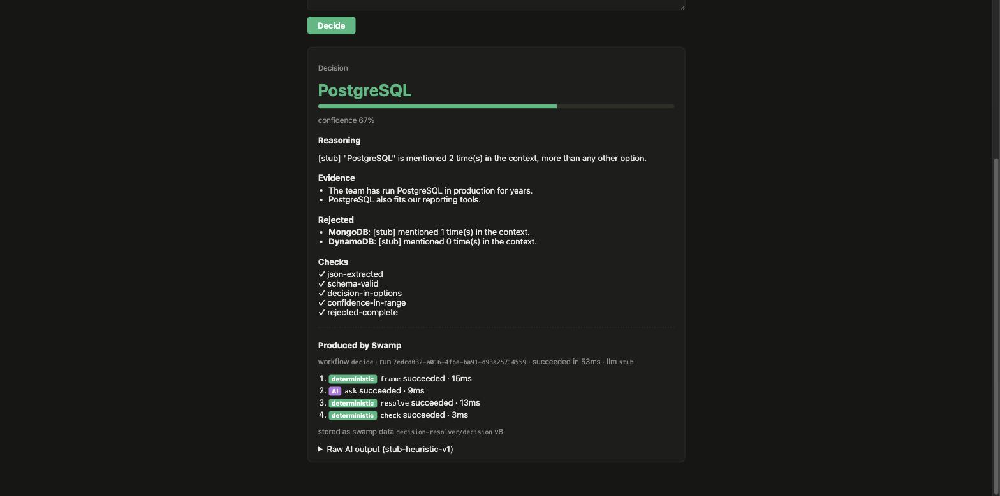

# Swamp for Everything

Experiments testing one hypothesis:

> Swamp can act as the deterministic application/runtime layer around
> non-deterministic AI components. The Swamp workflow is the application; models
> and agents are components invoked by it.

**Spike 1: Decision API** is built here. Give it a question, some context and
two or more options. A Swamp workflow returns a typed decision:

```json
{
  "decision": "PostgreSQL",
  "reasoning": "...",
  "evidence": ["The team has run PostgreSQL in production for years."],
  "confidence": 0.67,
  "rejected": [{ "option": "MongoDB", "reason": "..." }],
  "checks": [{ "name": "decision-in-options", "passed": true }],
  "ai": { "model": "stub-heuristic-v1", "rawResponse": "..." },
  "run": {
    "runId": "...",
    "steps": [{ "name": "frame", "status": "succeeded" }]
  }
}
```

Read [FINDINGS.md](FINDINGS.md) for what the spike taught us, and
[docs/architecture.md](docs/architecture.md) for where each boundary sits.



## Where things are

| Layer               | Path                                      | What it is                                                                         |
| ------------------- | ----------------------------------------- | ---------------------------------------------------------------------------------- |
| UI                  | `web/`                                    | React + Vite, run by Deno. One form. Only knows `POST /api/decide`.                |
| Glue                | `api/`                                    | ~230 lines of Deno. HTTP in, Swamp serve WebSocket out. No decision logic.         |
| **The application** | `decision/workflows/workflow-decide.yaml` | The Swamp workflow: `frame → ask → resolve → check`.                               |
| Deterministic steps | `decision/extensions/models/decision/`    | `@mesgme/decision` (`frame`, `resolve`) with pure logic in `_lib/logic.ts`.        |
| AI component        | `decision/models/`                        | `decision-llm-stub` (default) or `decision-llm-claude` (`@keeb/anthropic/claude`). |

## Prerequisites

- [swamp](https://swamp.club) (built against `20261002.023954.0`):
  `swamp --version`
- [Deno](https://deno.com) 2.x: `deno --version`

No Node or npm install is needed. Deno fetches the npm packages for Vite and
React.

## Run it

```bash
git clone https://github.com/mesgme/swamp-for-everything.git
cd swamp-for-everything

# One-time: install the pinned @keeb/anthropic extension from the lockfile.
(cd decision && swamp extension install)
```

Then start three terminals from the repo root:

```bash
deno task serve   # 1. Swamp serve on ws://127.0.0.1:9797   (Swamp begins here)
deno task api     # 2. Decision API on http://127.0.0.1:8787 (glue)
deno task web     # 3. UI on http://127.0.0.1:5180           (UI)
```

Open <http://127.0.0.1:5180>, keep the example (or type your own) and press
**Decide**. The result card ends with a **Produced by Swamp** trace. It shows
the workflow run ID, each step tagged as AI or deterministic, and the versioned
Swamp data artifact that holds the decision.

Without the UI:

```bash
curl -s -XPOST http://127.0.0.1:8787/api/decide \
  -H 'content-type: application/json' \
  -d '{"question":"Tea or coffee?","context":"Most people asked for tea.","options":["Coffee","Tea"]}'
```

Without the API, straight from Swamp:

```bash
cd decision
swamp workflow run decide --input '{"question":"Tea or coffee?","context":"Most people asked for tea.","options":["Coffee","Tea"]}'
swamp data get decision-resolver decision --json
```

### Responses

| Status | When                                                                                                          |
| ------ | ------------------------------------------------------------------------------------------------------------- |
| 200    | The run succeeded. Body is the typed decision plus `ai` and `run`.                                            |
| 400    | Bad request (missing question, fewer than two options, unknown `llm`), or Swamp rejected the workflow inputs. |
| 502    | The workflow run failed. `failedStep` names the step and `run.steps` has the trace.                           |
| 503    | Swamp serve is not reachable.                                                                                 |

## Switching the AI component to Claude

The default AI component is a deterministic **stub**. It counts how often each
option appears in the context and labels its output `[stub]`. This keeps the
demo free and repeatable. Claude is wired up through the registry extension
`@keeb/anthropic`, and its API key comes from a Swamp vault:

```bash
cd decision
swamp vault put decision-secrets ANTHROPIC_API_KEY   # prompts for the key; stored encrypted under .swamp/ (gitignored)
```

Then either send `"llm": "claude"` in an API request, or make Claude the API
default (the UI uses the default):

```bash
DECISION_LLM=claude deno task api
```

The Claude definition (model, system prompt, `vault.get` key reference) is in
`decision/models/@keeb/anthropic/claude/decision-llm-claude.yaml`.

## Configuration

| Env var        | Used by | Default                                          |
| -------------- | ------- | ------------------------------------------------ |
| `SWAMP_URL`    | api     | `ws://127.0.0.1:9797`                            |
| `SWAMP_TOKEN`  | api     | none (serve runs `--auth-mode none` on loopback) |
| `DECISION_LLM` | api     | `stub`                                           |
| `PORT`         | api     | `8787`                                           |

## Development

```bash
deno task test    # extension, API and UI helper unit tests
deno task check   # type-check
deno task lint
deno task fmt
```

`deno fmt` is kept away from the Swamp-managed YAML under `decision/`.
